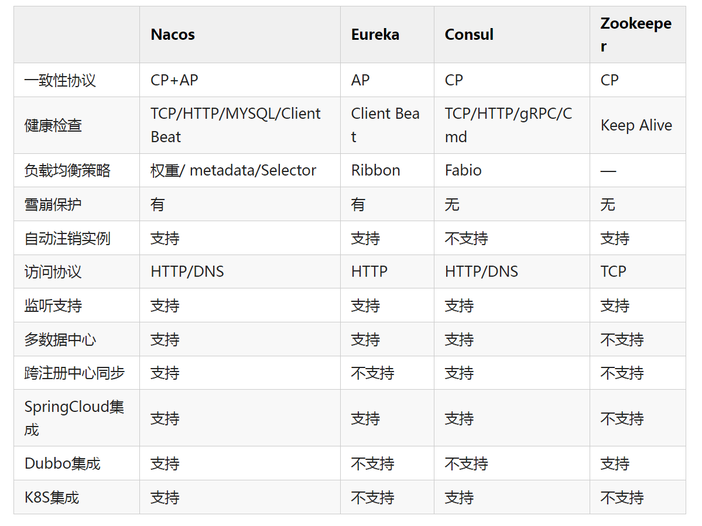

## 选举之后又是怎样进行数据同步的？
那实际上Zookeeper在选举之后，Follower和Observer（统称为Learner）就会去向Leader注册，然后就会开始数据同步的过程。

数据同步包含3个主要值和4种形式。

PeerLastZxid：Learner服务器最后处理的ZXID

minCommittedLog：Leader提议缓存队列中最小ZXID

maxCommittedLog：Leader提议缓存队列中最大ZXID

直接差异化同步 DIFF同步

如果PeerLastZxid在minCommittedLog和maxCommittedLog之间，那么则说明Learner服务器还没有完全同步最新的数据。

首先Leader向Learner发送DIFF指令，代表开始差异化同步，然后把差异数据（从PeerLastZxid到maxCommittedLog之间的数据）提议proposal发送给Learner
发送完成之后发送一个NEWLEADER命令给Learner，同时Learner返回ACK表示已经完成了同步
接着等待集群中过半的Learner响应了ACK之后，就发送一个UPTODATE命令，Learner返回ACK，同步流程结束
Image
先回滚再差异化同步 TRUNC+DIFF同步

这个设置针对的是一个异常的场景。

如果Leader刚生成一个proposal，还没有来得及发送出去，此时Leader宕机，重新选举之后作为Follower，但是新的Leader没有这个proposal数据。

举个栗子：

假设现在的Leader是A，minCommittedLog=1，maxCommittedLog=3，刚好生成的一个proposal的ZXID=4，然后挂了。

重新选举出来的Leader是B，B之后又处理了2个提议，然后minCommittedLog=1，maxCommittedLog=5。

这时候A的PeerLastZxid=4，在(1,5)之间。

那么这一条只存在于A的提议怎么处理？

A要进行事务回滚，相当于抛弃这条数据，并且回滚到最接近于PeerLastZxid的事务，对于A来说，也就是PeerLastZxid=3。

流程和DIFF一致，只是会先发送一个TRUNC命令，然后再执行差异化DIFF同步。

仅回滚同步 TRUNC同步

针对PeerLastZxid大于maxCommittedLog的场景，流程和上述一致，事务将会被回滚到maxCommittedLog的记录。

这个其实就更简单了，也就是你可以认为TRUNC+DIFF中的例子，新的Leader B没有处理提议，所以B中minCommittedLog=1，maxCommittedLog=3。

所以A的PeerLastZxid=4就会大于maxCommittedLog了，也就是A只需要回滚就行了，不需要执行差异化同步DIFF了。

全量同步 SNAP同步

适用于两个场景：

PeerLastZxid小于minCommittedLog
Leader服务器上没有提议缓存队列，并且PeerLastZxid不等于Leader的最大ZXID
这两种场景下，Leader将会发送SNAP命令，把全量的数据都发送给Learner进行同步。

## 有可能会出现数据不一致的问题吗？

查询不一致

因为Zookeeper是过半成功即代表成功，假设我们有5个节点，如果123节点写入成功，如果这时候请求访问到4或者5节点，那么有可能读取不到数据，因为可能数据还没有同步到4、5节点中，也可以认为这算是数据不一致的问题。

解决方案可以在读取前使用sync命令。

leader未发送proposal宕机

这也就是数据同步说过的问题。

leader刚生成一个proposal，还没有来得及发送出去，此时leader宕机，重新选举之后作为follower，但是新的leader没有这个proposal。

这种场景下的日志将会被丢弃。

leader发送proposal成功，发送commit前宕机

如果发送proposal成功了，但是在将要发送commit命令前宕机了，如果重新进行选举，还是会选择zxid最大的节点作为leader，因此，这个日志并不会被丢弃，会在选举出leader之后重新同步到其他节点当中。

## 如果作为注册中心，Zookeeper 和Eureka、Consul、Nacos有什么区别？

## 

    