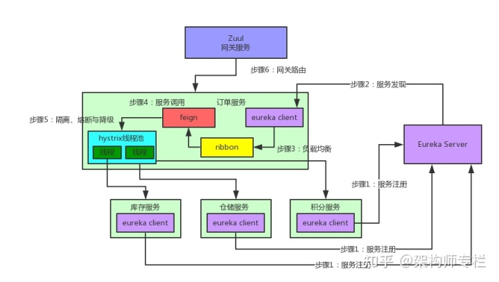

## SpringCloud有哪些缺点？或者你遇到哪些困难？
自动化组件：难以自动化，因为有许多较小的组件。因此，对于每个组件，我们必须遵循Build，Deploy和Monitor的各个阶段。

易感性：将大量组件维护在一起变得难以部署，维护，监控和识别问题。它需要在所有组件周围具有很好的感知能力。

配置管理：有时在各种环境中维护组件的配置变得困难。

调试：很难找到错误的每一项服务。维护集中式日志记录和仪表板以调试问题至关重要。

## springcloud核⼼组件及其作⽤，以及springcloud⼯作原理：

1、 Eureka：各个服务启动时，Eureka Client都会将服务注册到Eureka Server，并且Eureka Client还可以反过来从Eureka Server拉取注册表，从⽽知道其他服务在哪⾥

2、 Ribbon：服务间发起请求的时候，基于Ribbon做负载均衡，从⼀个服务的多台机器中选择⼀台

3、 Feign：基于Feign的动态代理机制，根据注解和选择的机器，拼接请求URL地址，发起请求

4、 Hystrix：发起请求是通过Hystrix的线程池来⾛的，不同的服务⾛不同的线程池，实现了不同服务调⽤的隔离，避免了服务雪崩的问题

5、 Zuul：如果前端、移动端要调⽤后端系统，统⼀从Zuul⽹关进⼊，由Zuul⽹关转发请求给对应的服务

## 有哪些接口限流的方法？
1、 限制 瞬时并发数（如 nginx 的 limit_conn 模块，⽤来限制 瞬时并发连接数）

2、 限制 时间窗⼝内的平均速率（如 Guava 的 RateLimiter、nginx 的 limit_req模块，限制每秒的平均速率）

3、 限制 远程接⼝ 调⽤速率

4、 限制 MQ 的消费速率

5、 可以根据⽹络连接数、⽹络流量、CPU或内存负载等来限流

## Zuul网关如何搭建集群
使用Nginx的upstream设置Zuul服务集群，通过location拦截请求并转发到upstream，默认使用轮询机制对Zuul集群发送请求。

## 微服务有哪些特点？
解耦 – 系统内的服务很大程度上是分离的。因此，整个应用程序可以轻松构建，更改和扩展

组件化 – 微服务被视为可以轻松更换和升级的独立组件

业务能力 – 微服务非常简单，专注于单一功能

自治 – 开发人员和团队可以彼此独立工作，从而提高速度

持续交付 – 通过软件创建，测试和批准的系统自动化，允许频繁发布软件

责任 – 微服务不关注应用程序作为项目。相反，他们将应用程序视为他们负责的产品

分散治理 – 重点是使用正确的工具来做正确的工作。这意味着没有标准化模式或任何技术模式。开发人员可以自由选择最有用的工具来解决他们的问题

敏捷 – 微服务支持敏捷开发。任何新功能都可以快速开发并再次丢弃
